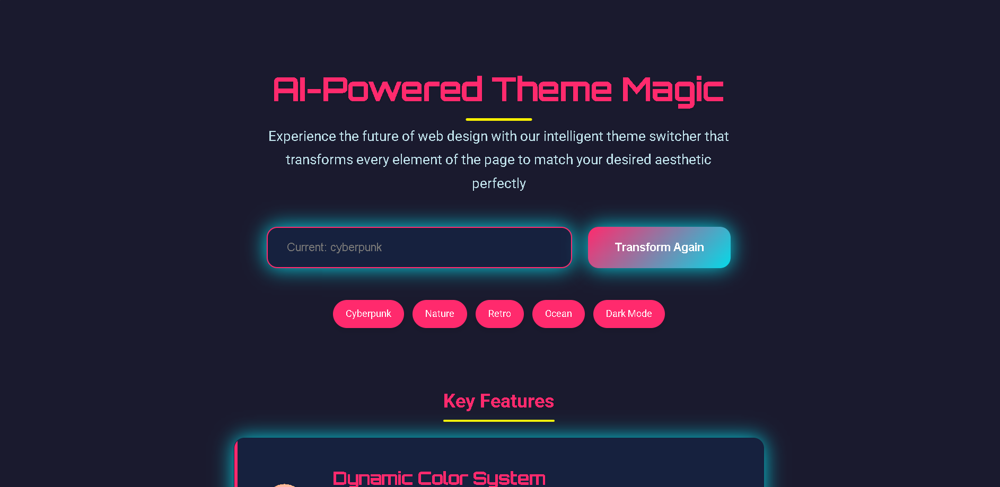
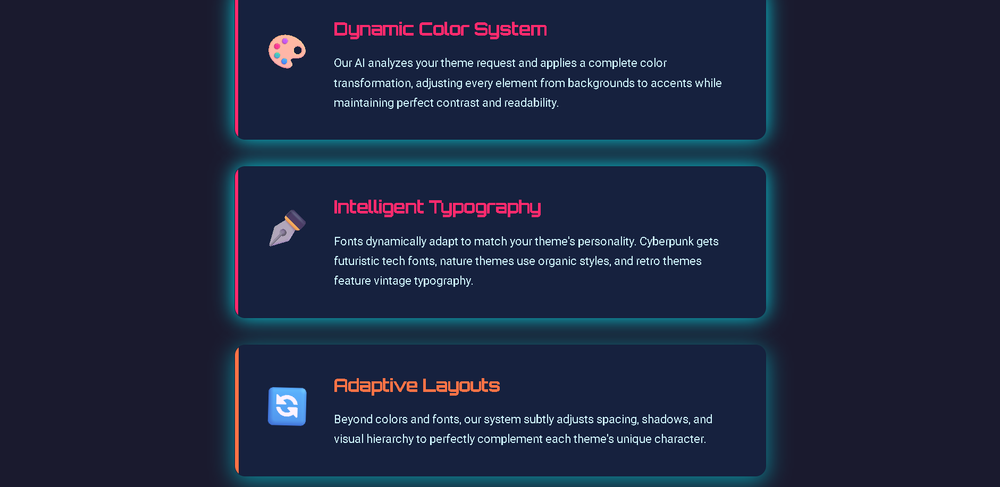

# 🌙 AI-Theme-Switcher 🎨🤖  

**AI-Theme-Switcher** is a simple and smart frontend project I created for my college event.  
Its main purpose is **AI-powered theme switching**, allowing users to easily toggle between light and dark modes.

---

## 🚀 Live Demo  
👉 [Click here to view the project](https://anuragverma4895.github.io/AI-Theme-Switcher/)

[](https://anuragverma4895.github.io/AI-Theme-Switcher/)

---

## ✨ Features
- 🎯 **AI-based theme switching**
- 🌗 **Light & Dark theme support**
- ⚡ Built with **HTML, CSS, and JavaScript**
- 📱 **Responsive design**
- 🖼️ **Screenshots included** for a better preview

---

## 📸 Screenshots  

### Homepage  
  


---

## 📺 Demo Video  
🎥 I also created a YouTube video for this project:  
👉 [Watch the video here](https://www.youtube.com/watch?v=MhkblLXhbws)

---

## 🛠️ Tech Stack
- **HTML5**  
- **CSS3**  
- **JavaScript**

---

## 📂 Project Structure
```bash
├── AiThemeSwitcher.html        # Main HTML file
├── AiThemeSwitcher-page-01.png # Screenshot 1
├── AiThemeSwitcher-page-02.png # Screenshot 2
└── README.md                   # Documentation
